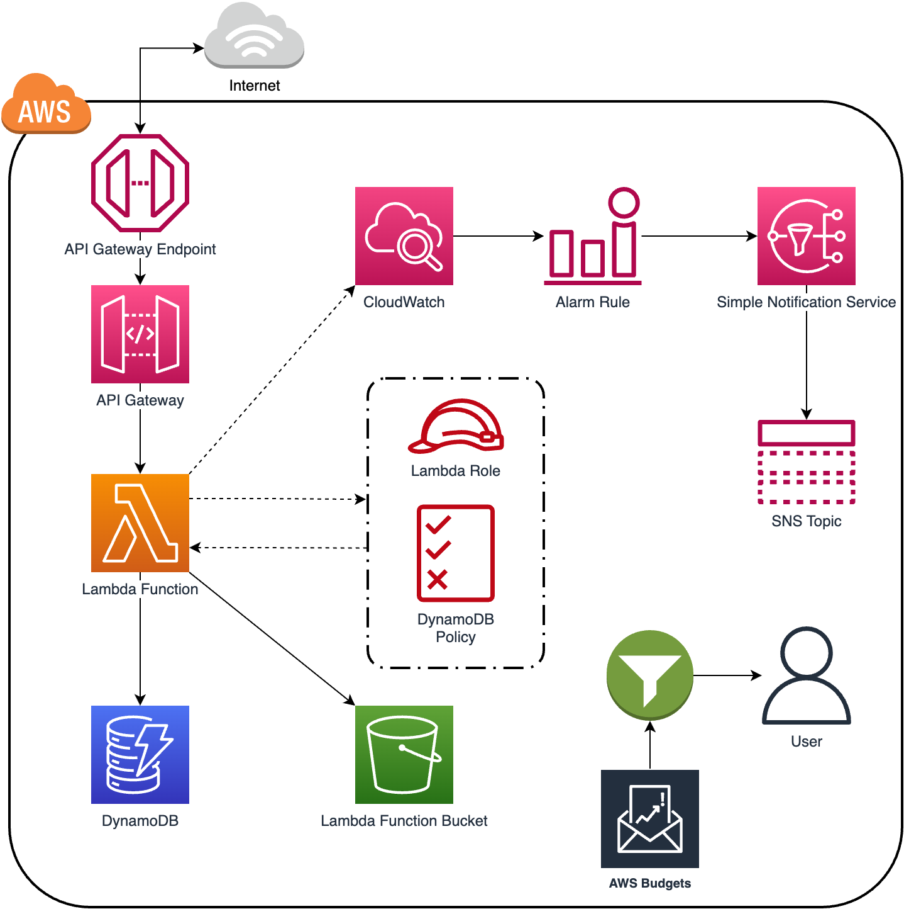

# Serverless API with DynamoDB Storage

This project demonstrates the creation of a serverless API using AWS API Gateway and AWS Lambda. The API triggers a Lambda function that interacts with a DynamoDB table to store data.

## Table of Contents

- [Project Overview](#project-overview)
- [Technologies Used](#technologies-used)
- [Getting Started](#getting-started)
  - [Prerequisites](#prerequisites)
  - [Deployment](#deployment)
- [Usage](#usage)
- [Screenshots](#screenshots)
- [Contributing](#contributing)
- [License](#license)

## Project Overview

This project showcases the following features:

- Creation of an API using AWS API Gateway.
- Integration of AWS Lambda to handle API requests.
- Interaction with DynamoDB for data storage.
- Serverless architecture for cost-effective scaling.

## Technologies Used

- AWS API Gateway
- AWS Lambda
- AWS DynamoDB
- Terraform (IaC)

## Getting Started

### Prerequisites

Before you begin, ensure you have the following:

- An AWS account.
- Terraform installed on your local machine.

### Deployment

1. Clone this repository to your local machine:

   ```sh
   git clone https://github.com/your-username/serverless-api-dynamodb.git
   cd serverless-api-dynamodb
   ```

2. Configure your AWS credentials by running:

   ```sh
   aws configure
   ```

3. Deploy the infrastructure using Terraform:

   ```sh
   cd terraform
   terraform init
   terraform plan -out .terraform.init
   terraform apply .terraform.init
   ```

4. Once deployed, note the API endpoint URL provided as output.

## Usage

To use the API, make a POST request to the provided API endpoint URL. The Lambda function will respond with a success message, and the data will be stored in DynamoDB.

Example request using `curl`:

```sh
curl -X POST -d '{"data": "my data"}' <API_ENDPOINT_URL>
```

## Screenshots

- **API Gateway Configuration:**
  

- **Project Architecture:**
  
